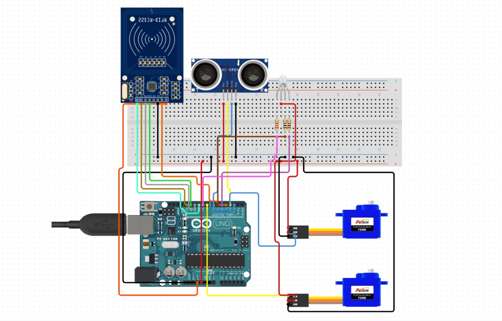

# Smart-Gate-System
Smart gate system interfaced using Arduino

### Schematics

### Components used
<ul>
  <li>Arduino x1</li>
  <li>RFID x1</li>
  <li>Ultrasonic sensor x1</li>
  <li>Servo Motor x2</li>
</ul>

### Logic
The smart gate system can be implemented at the entrance of any building, whether residential or at an office.
It provides user authentication using an RFID sensor. The person at the entrance may use a valid RFID tag to verify their identity.
When they have been successfully verified, the gate shall open and they are allowed to enter. But wait right there.
Since covid has been spreading like wild-fire throughout the world, it is always safer to keep our selves healthy and our hands clean at all times.
The smart gate system comes with a smart dispenser system too! When the user places their hand below the ultrasonic sensor, the valve is rotated and sanitizer solution is released. Then they may pass through the gate.
When they have passed through, the gate automatically shuts itself.
